# Use Case Diagram - Velociti AI Project Management System

## Overview
This document contains the use case diagram for the Velociti AI Project Management System, a web-based application that combines project management with Software Effort Estimation (SEE) model capabilities.

## Actors
- **Guest User**: Unauthenticated user who can register and log in
- **Authenticated User**: Logged-in user who can participate in projects
- **Admin**: User with administrative privileges (can create projects, manage members)
- **Project Member**: User who is a member of a project

## Use Case Diagram

```mermaid
graph TB
    %% Actors
    Guest[Guest User]
    User[Authenticated User]
    Admin[Admin]
    Member[Project Member]
    
    %% Authentication Use Cases
    subgraph Authentication["Authentication"]
        UC1[Sign Up]
        UC2[Sign In]
        UC3[Sign Out]
    end
    
    %% Project Management Use Cases
    subgraph ProjectMgmt["Project Management"]
        UC4[Create Project]
        UC5[View Projects]
        UC6[View Project Details]
        UC7[Update Project]
        UC8[Delete Project]
        UC9[Select Project]
    end
    
    %% Task Management Use Cases
    subgraph TaskMgmt["Task Management"]
        UC10[Create Task]
        UC11[View Tasks]
        UC12[View Task Details]
        UC13[Update Task]
        UC14[Delete Task]
        UC15[Reorder Tasks]
        UC16[Move Task Between Swimlanes]
    end
    
    %% SEE Model Use Cases
    subgraph SEEModel["SEE Model & Effort Estimation"]
        UC17[Set Task Attributes<br/>RELY, CPLX, ACAP, PCAP, TOOL, SCED]
        UC18[Calculate Estimated Effort]
        UC19[View Estimated Effort]
        UC20[View Actual Effort]
    end
    
    %% Task Assignment Use Cases
    subgraph TaskAssignment["Task Assignment"]
        UC21[Assign Member to Task]
        UC22[View Task Assignments]
        UC23[Remove Task Assignment]
    end
    
    %% Task Comments Use Cases
    subgraph TaskComments["Task Comments"]
        UC24[Add Comment to Task]
        UC25[View Task Comments]
        UC26[Delete Comment]
    end
    
    %% Team Management Use Cases
    subgraph TeamMgmt["Team Management"]
        UC27[View Project Members]
        UC28[Add Member to Project]
        UC29[Update Member Role]
        UC30[Remove Member from Project]
    end
    
    %% Swimlane Management Use Cases
    subgraph SwimlaneMgmt["Swimlane Management"]
        UC31[View Swimlanes]
        UC32[View Tasks by Swimlane]
    end
    
    %% Analytics & Reports Use Cases
    subgraph Analytics["Analytics & Reports"]
        UC33[View Project Analytics]
        UC34[View SEE Insights]
        UC35[View Team View]
    end
    
    %% Guest User connections
    Guest --> UC1
    Guest --> UC2
    
    %% Authenticated User connections
    User --> UC3
    User --> UC5
    User --> UC6
    User --> UC9
    User --> UC11
    User --> UC12
    User --> UC17
    User --> UC18
    User --> UC19
    User --> UC20
    User --> UC21
    User --> UC22
    User --> UC24
    User --> UC25
    User --> UC27
    User --> UC31
    User --> UC32
    User --> UC33
    User --> UC34
    User --> UC35
    
    %% Admin connections (includes all User use cases)
    Admin --> UC3
    Admin --> UC4
    Admin --> UC5
    Admin --> UC6
    Admin --> UC7
    Admin --> UC8
    Admin --> UC9
    Admin --> UC10
    Admin --> UC11
    Admin --> UC12
    Admin --> UC13
    Admin --> UC14
    Admin --> UC15
    Admin --> UC16
    Admin --> UC17
    Admin --> UC18
    Admin --> UC19
    Admin --> UC20
    Admin --> UC21
    Admin --> UC22
    Admin --> UC23
    Admin --> UC24
    Admin --> UC25
    Admin --> UC26
    Admin --> UC27
    Admin --> UC28
    Admin --> UC29
    Admin --> UC30
    Admin --> UC31
    Admin --> UC32
    Admin --> UC33
    Admin --> UC34
    Admin --> UC35
    
    %% Project Member connections
    Member --> UC5
    Member --> UC6
    Member --> UC9
    Member --> UC11
    Member --> UC12
    Member --> UC13
    Member --> UC15
    Member --> UC16
    Member --> UC17
    Member --> UC19
    Member --> UC20
    Member --> UC21
    Member --> UC22
    Member --> UC24
    Member --> UC25
    Member --> UC27
    Member --> UC31
    Member --> UC32
    Member --> UC33
    Member --> UC34
    
    %% Styling
    classDef actorClass fill:#e1f5ff,stroke:#01579b,stroke-width:2px
    classDef useCaseClass fill:#f3e5f5,stroke:#4a148c,stroke-width:1px
    classDef groupClass fill:#fff3e0,stroke:#e65100,stroke-width:2px
    
    class Guest,User,Admin,Member actorClass
    class UC1,UC2,UC3,UC4,UC5,UC6,UC7,UC8,UC9,UC10,UC11,UC12,UC13,UC14,UC15,UC16,UC17,UC18,UC19,UC20,UC21,UC22,UC23,UC24,UC25,UC26,UC27,UC28,UC29,UC30,UC31,UC32,UC33,UC34,UC35 useCaseClass
```

## Use Case Descriptions

### Authentication
- **Sign Up**: Guest users can create a new account
- **Sign In**: Users can authenticate to access the system
- **Sign Out**: Authenticated users can log out

### Project Management
- **Create Project**: Admins can create new projects with default swimlanes (Backlog, To Do, In Progress, Done)
- **View Projects**: Users can view list of available projects
- **View Project Details**: Users can view detailed information about a project
- **Update Project**: Admins can modify project name and description
- **Delete Project**: Admins can delete projects
- **Select Project**: Users can switch between projects

### Task Management
- **Create Task**: Admins can create new tasks with title, description, and SEE attributes
- **View Tasks**: Users can view all tasks in a project
- **View Task Details**: Users can view detailed information about a task
- **Update Task**: Users can modify task properties (title, description, attributes, swimlane)
- **Delete Task**: Admins can delete tasks
- **Reorder Tasks**: Users can reorder tasks within a swimlane (drag & drop)
- **Move Task Between Swimlanes**: Users can move tasks between different swimlanes

### SEE Model & Effort Estimation
- **Set Task Attributes**: Users can set SEE model attributes:
  - RELY (Reliability): 0.75 - 1.40
  - CPLX (Complexity): 0.70 - 1.65
  - ACAP (Analyst Capability): 0.71 - 1.46
  - PCAP (Programmer Capability): 0.70 - 1.42
  - TOOL (Tool Support): 0.83 - 1.24
  - SCED (Schedule Constraint): 1.00 - 1.23
- **Calculate Estimated Effort**: System calculates effort in person-months using SEE model formula
- **View Estimated Effort**: Users can view calculated effort estimates for tasks
- **View Actual Effort**: Users can view actual effort when tasks are completed

### Task Assignment
- **Assign Member to Task**: Users can assign project members to tasks
- **View Task Assignments**: Users can see who is assigned to each task
- **Remove Task Assignment**: Admins can remove assignments from tasks

### Task Comments
- **Add Comment to Task**: Project members can add comments to tasks
- **View Task Comments**: Users can view all comments on a task
- **Delete Comment**: Users can delete their own comments (implied from API structure)

### Team Management
- **View Project Members**: Users can view all members of a project
- **Add Member to Project**: Admins can add users to a project
- **Update Member Role**: Admins can change member roles (owner, member)
- **Remove Member from Project**: Admins can remove members from projects

### Swimlane Management
- **View Swimlanes**: Users can view all swimlanes in a project
- **View Tasks by Swimlane**: Users can see tasks organized by swimlane (Kanban board view)

### Analytics & Reports
- **View Project Analytics**: Users can view project-level analytics and metrics
- **View SEE Insights**: Users can view insights based on SEE model calculations
- **View Team View**: Users can view team-related information and statistics

## Notes
- Admin users have access to all use cases available to regular users, plus administrative functions
- Project members must be added to a project before they can fully participate
- The SEE model uses COCOMO-like cost drivers to estimate software development effort
- Tasks automatically track start and end dates when moved to "In Progress" and "Done" swimlanes respectively
- Actual effort is calculated automatically when a task is marked as done

